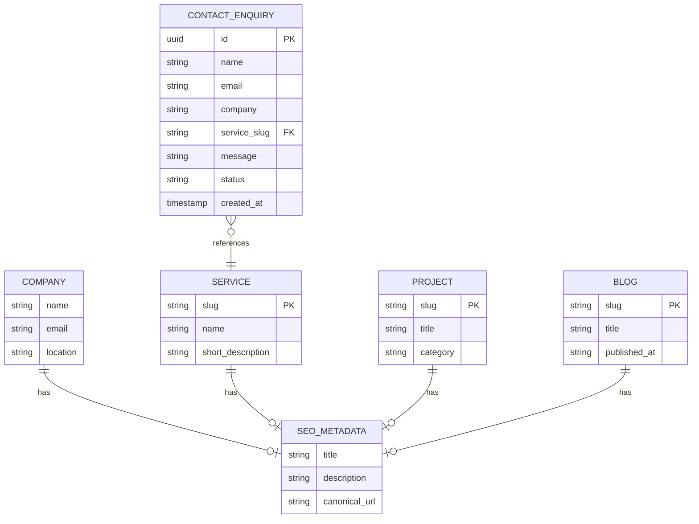

# Data and Content Schema Document
## KVYASH Technologies - Official Website

**Document Version:** 1.0.0  
**Status:** Draft / Pending Review  
**Date:** August 9, 2026  
**Author:** Backend Architecture & Data Team, KVYASH Technologies  

---

### Table of Contents
1. [Core Architectural Approach](#1-core-architectural-approach)
2. [Entity List and Descriptions](#2-entity-list-and-descriptions)
3. [Entity Relationship (ER) Diagram](#3-entity-relationship-er-diagram)
4. [Entity Relationships Explanation](#4-entity-relationships-explanation)
5. [Entity Specifications (Fields, Types, Validations)](#5-entity-specifications-fields-types-validations)
   - [Company Schema (Static JSON)](#company-schema-static-json)
   - [SEO Metadata Sub-Schema (Nested Schema)](#seo-metadata-sub-schema-nested-schema)
   - [Service Schema (Static MDX/JSON)](#service-schema-static-mdxjson)
   - [Project Schema (Static MDX/JSON)](#project-schema-static-mdxjson)
   - [Blog Schema (Static MDX)](#blog-schema-static-mdx)
   - [Contact Enquiry Schema (Dynamic Database Schema)](#contact-enquiry-schema-dynamic-database-schema)
6. [SQL Database Schema (Contact Enquiry)](#6-sql-database-schema-contact-enquiry)
7. [JSON Data & API Payload Examples](#7-json-data--api-payload-examples)
8. [Zod Validation Schema Examples](#8-zod-validation-schema-examples)
9. [CMS Content Model Definition](#9-cms-content-model-definition)

---

### 1. Core Architectural Approach
To ensure high performance and low operational complexity:
- **Static Content (Company, Services, Projects, Blogs):** Managed via version-controlled static JSON files or MDX (Markdown with JSX) pages. This removes the need for active databases, improving load speed and scaling security.
- **Dynamic Content (Contact Enquiries):** Submitted to serverless endpoints. For tracking and backup purposes, enquiries are saved in a simple, relational database table (e.g., PostgreSQL or SQLite) before being dispatched via Resend/SendGrid.

---

### 2. Entity List and Descriptions

| Entity Name | Storage Medium | Lifecycle Responsibility | Description |
| :--- | :--- | :--- | :--- |
| **Company** | Static Config (`/config/company.json`) | Dev/Git | Holds metadata configurations for KVYASH Technologies (contact emails, address, logos). |
| **Service** | Markdown (`/content/services/*.mdx`) | Content Editor/Git | Outlines the six core services, including features, benefits, process stages, and specific FAQs. |
| **Project** | Markdown (`/content/projects/*.mdx`) | Content Editor/Git | Describes simulated architecture challenges and system solutions built by KVYASH. |
| **Blog** | Markdown (`/content/blog/*.mdx`) | Content Editor/Git | Houses technical insights, development guides, and software engineering articles. |
| **Contact Enquiry** | Database Table (`contact_enquiries`) | Dynamic Database | Captures prospective client inquiries and tracks lead conversion states. |

---

### 3. Entity Relationship (ER) Diagram



---

### 4. Entity Relationships Explanation
1. **SEO Metadata Relationship:** A nested object present in every content schema page (Services, Projects, Blogs).
2. **Contact Enquiry to Service Relationship:** A Contact Enquiry references a specific `service_slug` (e.g., `ai-solutions`) to catalog incoming leads by project requirements.

---

### 5. Entity Specifications (Fields, Types, Validations)

#### Company Schema (Static JSON)
- **Primary Key:** None (Single record config file).
- **Unique Constraints:** None.

| Field Name | Type | Required | Validation Rules | Description |
| :--- | :--- | :--- | :--- | :--- |
| `name` | String | Yes | Min length 2, Max 100 | Official brand name. |
| `description` | String | Yes | Max 300 characters | Core elevator pitch. |
| `mission` | String | Yes | Max 500 characters | Corporate mission. |
| `vision` | String | Yes | Max 500 characters | Corporate vision. |
| `email` | String (Email) | Yes | Valid email syntax | Main contact inbox. |
| `phone` | String | No | Regex matching international phone specs | Office phone number (optional). |
| `location` | String | Yes | Max 200 characters | Primary business timezone/location. |
| `logo` | String (Path) | Yes | Valid file path (`/logo.svg`) | Primary brand logo. |
| `favicon` | String (Path) | Yes | Valid file path (`/favicon.ico`) | Tab favicon. |
| `social_links` | Array (Object) | Yes | Must contain valid URLs | Profiles on LinkedIn, GitHub, etc. |

---

#### SEO Metadata Sub-Schema (Nested Schema)
Reusable SEO layout object embedded in other entities.

| Field Name | Type | Required | Validation Rules | Description |
| :--- | :--- | :--- | :--- | :--- |
| `title` | String | Yes | Max 60 characters | Tab title. |
| `description` | String | Yes | Max 160 characters | Meta description for search engines. |
| `keywords` | Array (String) | Yes | Max 10 items | Indexing tag keys. |
| `canonical_url`| String (URL) | Yes | Valid URL | Canonical source URL. |
| `og_image` | String (Path) | Yes | Valid image path | Social sharing link graphic. |
| `robots` | String | Yes | Enum: `'index, follow'` \| `'noindex, nofollow'` | Web crawler instructions. |
| `schema_type` | String | Yes | Enum: `'Organization'` \| `'Article'` \| `'Service'` | Structured schema definition type. |

---

#### Service Schema (Static MDX/JSON)
- **Primary Key:** `slug` (String, unique).

| Field Name | Type | Required | Validation Rules | Description |
| :--- | :--- | :--- | :--- | :--- |
| `id` | UUID/String | Yes | Unique identifier | System ID. |
| `slug` | String | Yes | Regex: `^[a-z0-9-]+$` | URL slug identifier. |
| `name` | String | Yes | Min 3, Max 100 characters | Name of the service. |
| `short_description` | String | Yes | Max 200 characters | Card snippet content. |
| `description` | String | Yes | Rich text markdown block | Full details page text. |
| `icon` | String | Yes | Valid Lucide icon string identifier | Card layout icon. |
| `features` | Array (String) | Yes | Min 1, Max 10 list items | Deliverables list. |
| `benefits` | Array (String) | Yes | Min 1, Max 10 list items | Specific client value points. |
| `process` | Array (String) | Yes | Ordered lifecycle list | Delivery phase list. |
| `faq` | Array (Object) | Yes | Array of Question-Answer strings | Specific service FAQs. |
| `seo_metadata` | Object (SEO) | Yes | Conforms to SEO Sub-Schema | Page-specific metadata parameters. |

---

#### Project Schema (Static MDX/JSON)
- **Primary Key:** `slug` (String, unique).

| Field Name | Type | Required | Validation Rules | Description |
| :--- | :--- | :--- | :--- | :--- |
| `id` | UUID/String | Yes | Unique identifier | System ID. |
| `slug` | String | Yes | Regex: `^[a-z0-9-]+$` | URL slug identifier. |
| `title` | String | Yes | Min 5, Max 150 characters | Title of the solution. |
| `description` | String | Yes | Rich text markdown block | Problem-solution narrative. |
| `category` | String | Yes | Enum: Core Services lists | Tech domain catalog. |
| `thumbnail` | String (Path) | Yes | Valid image path | Card preview image. |
| `images` | Array (String) | Yes | Valid image paths | Dynamic screen captures. |
| `technologies` | Array (String)| Yes | Min 1 item | Stack used in this solution. |
| `live_url` | String (URL) | No | Valid URL | Optional link to live project. |
| `github_url` | String (URL) | No | Valid URL | Link to open-source details. |
| `status` | String | Yes | Enum: `'completed'` \| `'ongoing'` | Development status. |
| `featured` | Boolean | Yes | Default: `false` | Promotes to home page list. |
| `seo_metadata` | Object (SEO) | Yes | Conforms to SEO Sub-Schema | Page-specific metadata. |

---

#### Blog Schema (Static MDX)
- **Primary Key:** `slug` (String, unique).

| Field Name | Type | Required | Validation Rules | Description |
| :--- | :--- | :--- | :--- | :--- |
| `id` | UUID/String | Yes | Unique identifier | System ID. |
| `slug` | String | Yes | Regex: `^[a-z0-9-]+$` | URL slug identifier. |
| `title` | String | Yes | Min 10, Max 200 characters | Post title. |
| `excerpt` | String | Yes | Min 30, Max 250 characters | Short description for cards. |
| `content` | String | Yes | Rich text markdown block | Post markdown body. |
| `cover_image` | String (Path) | Yes | Valid image path | Header image link. |
| `author` | String | Yes | Name values | Author details. |
| `category` | String | Yes | Enum: Tags | Primary category classification. |
| `tags` | Array (String) | Yes | Min 1 tag | Filtering metadata. |
| `published_at` | String (Date) | Yes | ISO 8601 Date string | Publication date. |
| `updated_at` | String (Date) | Yes | ISO 8601 Date string | Last modification date. |
| `seo_metadata` | Object (SEO) | Yes | Conforms to SEO Sub-Schema | Page-specific metadata. |

---

#### Contact Enquiry Schema (Dynamic Database Schema)
- **Primary Key:** `id` (UUID, autogenerated).
- **Index:** `created_at` (DESC) for list sorting; `email` for duplicate search.

| Field Name | Type | Required | Validation Rules | Description |
| :--- | :--- | :--- | :--- | :--- |
| `id` | UUID | Yes | Autogenerated Primary Key | Unique submission ID. |
| `name` | String | Yes | Min 2, Max 100 characters | Sender's full name. |
| `email` | String | Yes | Valid email format | Sender's email address. |
| `company` | String | No | Max 100 characters | Organization name (optional). |
| `service` | String | Yes | Enum: Core Services lists | Target service category. |
| `message` | String | Yes | Min 10, Max 2000 characters | Project details or description. |
| `status` | String | Yes | Enum: `'new'` \| `'contacted'` \| `'resolved'` | Internal management status. |
| `created_at` | Timestamp | Yes | Default: `NOW()` | Submission timestamp. |

---

### 6. SQL Database Schema (Contact Enquiry)
Below is the PostgreSQL schema definition for persistent lead capturing (in case a relational database is configured in the environment):

```sql
-- Enable UUID extension if not active
CREATE EXTENSION IF NOT EXISTS "uuid-ossp";

-- Define Enum for Enquiry Status
CREATE TYPE enquiry_status AS ENUM ('new', 'contacted', 'resolved');

-- Create Contact Enquiries Table
CREATE TABLE contact_enquiries (
    id UUID PRIMARY KEY DEFAULT uuid_generate_v4(),
    name VARCHAR(100) NOT NULL,
    email VARCHAR(255) NOT NULL,
    company VARCHAR(100),
    service VARCHAR(50) NOT NULL,
    message TEXT NOT NULL,
    status enquiry_status NOT NULL DEFAULT 'new',
    created_at TIMESTAMP WITH TIME ZONE DEFAULT CURRENT_TIMESTAMP NOT NULL
);

-- Index optimization for sorting and analysis queries
CREATE INDEX idx_enquiries_created_at ON contact_enquiries (created_at DESC);
CREATE INDEX idx_enquiries_status ON contact_enquiries (status);
```

---

### 7. JSON Data & API Payload Examples

#### Static Company Config `/config/company.json`
```json
{
  "name": "KVYASH Technologies",
  "description": "We build thoughtful digital solutions that solve real business problems.",
  "mission": "To engineer reliable, performant, and scale-ready software solutions without the bloat.",
  "vision": "To establish long-term technology partnerships through transparent execution and technical clarity.",
  "email": "hello@kvyash.com",
  "phone": "+918123456789",
  "location": "Bengaluru, India (IST)",
  "logo": "/logo.svg",
  "favicon": "/favicon.ico",
  "social_links": [
    { "platform": "LinkedIn", "url": "https://linkedin.com/company/kvyash" },
    { "platform": "GitHub", "url": "https://github.com/kvyash" }
  ]
}
```

#### API Payload: `POST /api/contact`
```json
{
  "name": "Siddharth Mehta",
  "email": "siddharth@startupspace.io",
  "company": "StartupSpace Inc.",
  "service": "saas-development",
  "message": "We are seeking a development partner to build out a Next.js MVP with microservice capabilities. Looking to kick off scoping this month."
}
```

#### API Response: Success
```json
{
  "success": true,
  "message": "Enquiry received successfully. Our engineering team will follow up within 24 hours.",
  "id": "f51239aa-ecf7-4148-9b88-cd6ff6412fb7"
}
```

---

### 8. Zod Validation Schema Examples

This schema is used to validate contact form inputs on both the client (React Hook Form) and the server (Next.js API route):

```typescript
import { z } from 'zod';

export const contactFormSchema = z.object({
  name: z.string()
    .min(2, { message: 'Name must be at least 2 characters.' })
    .max(100, { message: 'Name must not exceed 100 characters.' }),
  
  email: z.string()
    .email({ message: 'Please enter a valid email address.' }),
  
  company: z.string()
    .max(100, { message: 'Company name must not exceed 100 characters.' })
    .optional(),
  
  service: z.enum([
    'web-development',
    'custom-software',
    'ai-solutions',
    'business-automation',
    'saas-development',
    'application-development'
  ], {
    errorMap: () => ({ message: 'Please select a valid service category.' })
  }),
  
  message: z.string()
    .min(10, { message: 'Message must be at least 10 characters.' })
    .max(2000, { message: 'Message must not exceed 2000 characters.' }),
});

export type ContactFormData = z.infer<typeof contactFormSchema>;
```

---

### 9. CMS Content Model Definition
Below is an MDX frontmatter configuration example for a blog post (CMS file: `/content/blog/scaling-nextjs-applications.mdx`):

```markdown
---
id: "b4923e42-7cf3-4011-8be5-48b0129cf99d"
slug: "scaling-nextjs-applications"
title: "Scaling Next.js Applications on Modern Edge Networks"
excerpt: "An engineering deep-dive into configuring Incremental Static Regeneration (ISR) and optimization headers for fast global deployments."
cover_image: "/images/blog/scaling-nextjs.webp"
author: "KVYASH Engineering"
category: "Engineering"
tags: ["Next.js", "Vercel", "Web Performance"]
published_at: "2026-08-09T08:24:51+05:30"
updated_at: "2026-08-09T08:24:51+05:30"
seo_metadata:
  title: "Scaling Next.js Applications on the Edge | KVYASH"
  description: "Learn how to optimize Next.js ISR, cache headers, and bundle weights for optimal web performance."
  keywords: ["Next.js", "Web Performance", "Edge Rendering"]
  canonical_url: "https://kvyash.com/insights/scaling-nextjs-applications"
  og_image: "/images/blog/scaling-nextjs-og.png"
  robots: "index, follow"
  schema_type: "Article"
---

# Scaling Next.js Applications on Modern Edge Networks

Here begins the markdown body content...
```

---
*End of Data and Content Schema Document*
