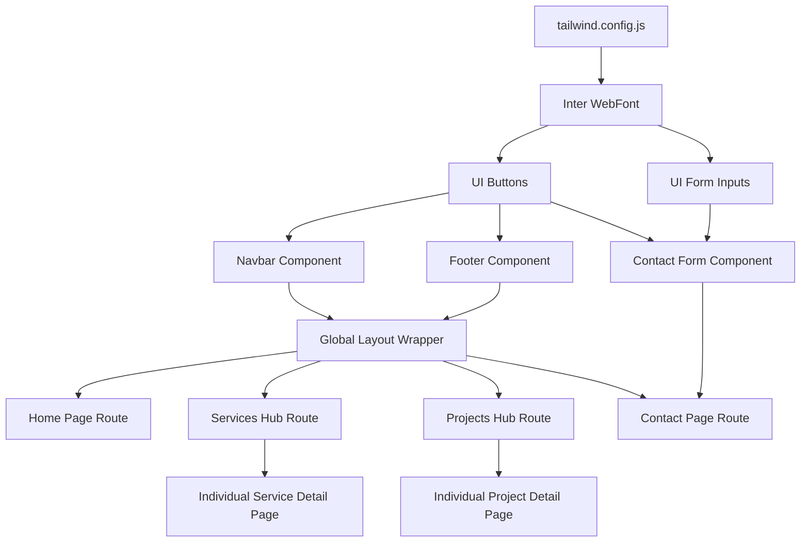

# Master Implementation Plan
## KVYASH Technologies - Official Website

**Document Version:** 1.0.0  
**Status:** Pending Approval  
**Date:** August 9, 2026  
**Author:** Technical Lead & Project Manager, KVYASH Technologies  

---

### Table of Contents
1. [Overview & Strategy](#overview--strategy)
2. [Recommended Development Order](#recommended-development-order)
3. [Component Dependency Map](#component-dependency-map)
4. [Phased Project Implementation Roadmap](#phased-project-implementation-roadmap)
   - [Phase 0: Discovery & Scoping](#phase-0-discovery--scoping)
   - [Phase 1: Project Setup & Linting](#phase-1-project-setup--linting)
   - [Phase 2: Design System & Design Tokens](#phase-2-design-system--design-tokens)
   - [Phase 3: Core Components Layouts](#phase-3-core-components-layouts)
   - [Phase 4: Pages & Route Assembly](#phase-4-pages--route-assembly)
   - [Phase 5: Serverless Backend & Form Integrations](#phase-5-serverless-backend--form-integrations)
   - [Phase 6: Search Engine Optimization (SEO)](#phase-6-search-engine-optimization-seo)
   - [Phase 7: Performance Optimizations](#phase-7-performance-optimizations)
   - [Phase 8: Automated & Manual Testing](#phase-8-automated--manual-testing)
   - [Phase 9: Security Layer Configuration](#phase-9-security-layer-configuration)
   - [Phase 10: Production Deployment & Infrastructure](#phase-10-production-deployment-infrastructure)
   - [Phase 11: Production Launch Checklist](#phase-11-production-launch-checklist)
5. [Git & Branching Workflow Strategy](#git--branching-workflow-strategy)
6. [Commit and Versioning Conventions](#commit-and-versioning-conventions)
7. [Environment & Configuration Setup](#environment--configuration-setup)
8. [Testing & QA Framework Strategy](#testing--qa-framework-strategy)
9. [Deployment & Infrastructure Topology](#deployment--infrastructure-topology)
10. [Rollback & Disaster Recovery Procedures](#rollback--disaster-recovery-procedures)
11. [Future Scalability Plan](#future-scalability-plan)

---

### Overview & Strategy
This document translates the approved PRD, TRD, User Flow, and Database Schema into a production-ready implementation schedule. The core principle is **minimizing architectural complexity** while maintaining premium quality. We use Next.js App Router static-first rendering, local Git-based MDX file data structures for blog/services/projects, and serverless logic for form collection.

---

### Recommended Development Order
1. **Setup & Tokens:** Initialize Next.js repository, Tailwind configuration, and folder layout.
2. **Global Components:** Build Navbar, Mobile Drawer, and Footer.
3. **Typography & UI Atoms:** Code UI buttons, form inputs, badges, and card boundaries.
4. **Services & Project Hubs:** Implement static MDX schemas and template dynamic pages.
5. **Home & Inside Pages:** Assemble layout structure, scrolling fades, and section sections.
6. **Integrations:** Hook up `/api/contact` routes, honeypot filters, and Resend email hooks.
7. **Production Prep:** Configure SEO scripts, sitemap triggers, Playwright tests, and Edge CDN routing parameters.

---

### Component Dependency Map



---

### Phased Project Implementation Roadmap

---

#### Phase 0: Discovery & Scoping
- **Objective:** Establish real data parameters, confirm brand palette assets, and prevent scoping blockages.
- **Tasks:**
  - Verify official inbox email for lead deliveries.
  - Source SVG logo assets (light/dark mode layouts).
  - Draft initial copy outlines for the 6 core services.
- **Dependencies:** None.
- **Deliverables:** Verified company asset catalog, brand assets dictionary in root directory.
- **Acceptance Criteria:** Brand assets and copy texts validated by project stakeholders.
- **Estimated Complexity:** Low (P0).
- **Risks:** Delays in copy drafting push out visual asset timeline.
- **Responsible Role:** Product Owner & Stakeholder.
- **Definition of Done (DoD):** Phase 0 directory containing verified SVG graphics and plain-text brand statements is pushed to repository.

---

#### Phase 1: Project Setup & Linting
- **Objective:** Configure Next.js, ESLint, Prettier, and TypeScript checks.
- **Tasks:**
  - Initialize Next.js 14+ via `npx create-next-app` using TypeScript, Tailwind, and App Router configuration.
  - Setup `.eslintrc.json` and `.prettierrc` for uniform code formats.
  - Configure absolute imports mapping (`@/*` to root folders).
- **Dependencies:** Phase 0 confirmation.
- **Deliverables:** Initialized Next.js project structure in GitHub repository.
- **Acceptance Criteria:** Linting checks run without error messages.
- **Estimated Complexity:** Low (P0).
- **Risks:** Version misalignment among styling dependencies. Mitigated by using default Next.js setups.
- **Responsible Role:** DevOps Engineer / Tech Lead.
- **Definition of Done (DoD):** GitHub branch setup compiles, and standard dev build executes cleanly.

---

#### Phase 2: Design System & Design Tokens
- **Objective:** Map styling guidelines directly inside Tailwind to provide uniform interfaces.
- **Task:**
  - Implement palette mappings (KVYASH Blue `#2563EB`, Navy `#0F172A`, Slate backgrounds) inside `tailwind.config.js`.
  - Install **Lucide React** for UI icons.
  - Import Inter font subsets via `next/font/google`.
- **Dependencies:** Phase 1 compilation.
- **Deliverables:** Configured `tailwind.config.js` and global stylesheet variables in `styles/globals.css`.
- **Acceptance Criteria:** Tailwind classes apply brand values accurately across all screens.
- **Estimated Complexity:** Low (P0).
- **Risks:** Missing default text styling values leads to styling deviations. Mitigated by referencing UI Design Spec tokens.
- **Responsible Role:** Lead Frontend Developer.
- **Definition of Done (DoD):** Typography and palette tokens render correctly on a design system documentation page.

---

#### Phase 3: Core Components Layouts
- **Objective:** Code the core UI components used across the website.
- **Tasks:**
  - Build UI Atoms: Button primitives, text input elements, badging tags, and empty containers.
  - Build global Navbar with responsive sticky blur triggers.
  - Build Footer containing sitemap columns and copyright texts.
- **Dependencies:** Phase 2 tokens.
- **Deliverables:** Components code inside `/components` and `/components/ui`.
- **Acceptance Criteria:** Components scale down to 320px screen widths without layout overflow.
- **Estimated Complexity:** Medium (P0).
- **Risks:** Mobile menu click blockages. Mitigated by keeping layout logic simple.
- **Responsible Role:** UI Developer.
- **Definition of Done (DoD):** Navbar mobile drawer transitions smoothly and is fully navigable by keyboard focus.

---

#### Phase 4: Pages & Route Assembly
- **Objective:** Build out the static marketing routes (Home, About, Services, Projects, Insights, contact, 404).
- **Tasks:**
  - Assemble Home page blocks (Hero, Services list, Process steps, CTA footer).
  - Code Service and Project detail pages, mapping Markdown datasets.
  - Configure the 404 template route.
- **Dependencies:** Phase 3 components.
- **Deliverables:** Directory routes active within the `/app` folder.
- **Acceptance Criteria:** Static paths render on local server using actual MDX dataset values.
- **Estimated Complexity:** High (P0).
- **Risks:** Broken links across markdown index lists. Mitigated by defining strict validation tags.
- **Responsible Role:** Frontend Developer.
- **Definition of Done (DoD):** Dynamic slugs match their markdown filenames, and pages compile static files during build.

---

#### Phase 5: Serverless Backend & Form Integrations
- **Objective:** Enable secure contact form processing and email routing.
- **Tasks:**
  - Write Next.js API handler `/api/contact/route.ts` validating payload structure via Zod.
  - Integrate **Resend SDK** or **SendGrid API** to dispatch incoming leads.
  - Configure honeypot hidden field filters to trap bot submissions.
- **Dependencies:** Phase 4 Contact route.
- **Deliverables:** Serverless api code, email templates, and environment variable parameters.
- **Acceptance Criteria:** Submitting contact forms triggers a transactional email to `hello@kvyash.com`.
- **Estimated Complexity:** Medium (P0).
- **Risks:** Email deliveries fail spam filters. Mitigated by verifying custom domains (DKIM/SPF) on target provider.
- **Responsible Role:** Full Stack Engineer.
- **Definition of Done (DoD):** Contact form successfully dispatches submissions to the verified business email.

---

#### Phase 6: Search Engine Optimization (SEO)
- **Objective:** Configure metadata structures to drive search engine index listings.
- **Tasks:**
  - Deploy default metadata exports in root `layout.tsx` (Description, OpenGraph properties).
  - Write dynamic `sitemap.ts` to output `sitemap.xml` listing all static pages.
  - Configure `robots.ts` to allow full search engine indexing.
- **Dependencies:** Phase 4 page routing.
- **Deliverables:** Static `robots.txt`, dynamic sitemaps generator, and JSON-LD schema integrations.
- **Acceptance Criteria:** Google Rich Results tool indexes structural data without syntax warnings.
- **Estimated Complexity:** Medium (P1).
- **Risks:** Outdated slugs indexed in sitemaps. Mitigated by linking generator dynamically to the routing directories.
- **Responsible Role:** SEO Specialist / Frontend Developer.
- **Definition of Done (DoD):** Dynamic `sitemap.xml` compiles, is search engine indexable, and JSON-LD metadata renders on the live home page.

---

#### Phase 7: Performance Optimizations
- **Objective:** Optimize loading performance, aiming for A-grade Core Web Vitals scores.
- **Tasks:**
  - Replace raster visual elements with modern WebP formatting, applying `<Image>` height/width properties.
  - Setup font swap configuration blocks to prevent layout shifts.
  - Configure cache headers inside Vercel/CDN deployment profiles.
- **Dependencies:** Phase 4 completion.
- **Deliverables:** Audited image files, custom build compilation optimization headers.
- **Acceptance Criteria:** Desktop PageSpeed Lighthouse performance rating measures above 95.
- **Estimated Complexity:** Medium (P1).
- **Risks:** Image quality degrades. Mitigated by verifying responsive layouts manually.
- **Responsible Role:** Tech Lead.
- **Definition of Done (DoD):** Build bundle analyzer runs, showing all page payloads fit under 150kb chunks.

---

#### Phase 8: Automated & Manual Testing
- **Objective:** Validate system performance, forms, and browser compatibility.
- **Tasks:**
  - Write Jest tests verifying contact form validation logic.
  - Write E2E Playwright tests checking critical user flows.
  - Run accessibility tests to verify keyboard focus routing.
- **Dependencies:** Phase 5 integration.
- **Deliverables:** Automated test script directory `/tests` and matching GitHub Action checking triggers.
- **Acceptance Criteria:** Playwright tests complete without errors on Chrome, Firefox, and Safari targets.
- **Estimated Complexity:** Medium (P1).
- **Risks:** Complex tests slow down CI pipeline. Mitigated by targeting core user flows only.
- **Responsible Role:** QA Engineer.
- **Definition of Done (DoD):** Main codebase passes all automated test suites on deployment push checks.

---

#### Phase 9: Security Layer Configuration
- **Objective:** Set up security headers and prevent spam attacks.
- **Tasks:**
  - Configure secure response headers (CSP, Frame-Options, XSS protection).
  - Implement rate limiting (e.g., limit IP addresses to 5 contact submissions per hour).
  - Sanitize text inputs inside api paths before dispatch.
- **Dependencies:** Phase 5 integrations.
- **Deliverables:** Next.js middleware configurations and api-side validation middleware.
- **Acceptance Criteria:** Standard security headers rank at "A" rating on securityheaders.com diagnostics.
- **Estimated Complexity:** Medium (P1).
- **Risks:** Content Security Policy limits local script executions. Mitigated by verifying CSP properties in development staging environments.
- **Responsible Role:** Tech Lead / Security Engineer.
- **Definition of Done (DoD):** Contact form limits spam submissions, and security audits pass successfully.

---

#### Phase 10: Production Deployment & Infrastructure
- **Objective:** Host the website live on an Edge CDN network.
- **Tasks:**
  - Create project on hosting platform (Vercel or Netlify) linked to the repository.
  - Configure custom domains, DNS pointers, and automated SSL setups.
  - Setup environment variable secrets on host dashboard.
- **Dependencies:** All previous phases.
- **Deliverables:** Live, SSL-secured production website URL.
- **Acceptance Criteria:** Target site resolves securely at custom domain address (e.g., `kvyash.com`).
- **Estimated Complexity:** Low (P0).
- **Risks:** SSL routing downtime during DNS pointer switch. Mitigated by pre-validating routing certificates.
- **Responsible Role:** DevOps Engineer.
- **Definition of Done (DoD):** Website resolves on the custom domain with valid SSL, and builds trigger automatically on git pushes.

---

#### Phase 11: Production Launch Checklist
Below is the definitive launch checklist to be verified before public launch:

```markdown
### Visual Design & Rendering
- [ ] Visual styling matches approved UI Design System specs across breakpoints (320px, 768px, 1280px).
- [ ] Hover states and transition animations render smoothly at 60fps.
- [ ] Clean, styled 404 page redirects correctly.

### Content & Typography
- [ ] All copy reviewed and free of placeholders, spelling errors, or grammar issues.
- [ ] Zero fake claims, fake clients, or fake statistics included.
- [ ] Contact details are accurate and verified.

### SEO Verification
- [ ] Metadata tags populated for all active pages.
- [ ] `sitemap.xml` generates dynamically and references correct URLs.
- [ ] `robots.txt` is active and references the correct sitemap location.
- [ ] Structured data (JSON-LD) parses without errors.

### Performance Audit
- [ ] PageSpeed Lighthouse performance score exceeds 90 on mobile.
- [ ] First Contentful Paint (FCP) measures under 1.5 seconds.
- [ ] Images optimized (WebP/SVG format) and serve dynamically.

### Forms & Integrations
- [ ] Contact form passes Zod validation checks.
- [ ] Submissions route correctly to the production inbox.
- [ ] Honeypot spam filtering blocks automated bot submissions.
- [ ] Submissions rate-limited at 5 requests/hour per IP.

### Analytics & Compliance
- [ ] Analytics tracking scripts load correctly without blocking page rendering.
- [ ] Privacy policy is active and linked from the footer.
```

---

### Git & Branching Workflow Strategy
We adopt a lightweight **GitHub Flow** strategy to keep deployments agile and secure.

```
                  [main branch (production)]
                  /                        \
      [feature/setup]                    [feature/forms]
      - Dev & Lint setup                 - API setup & validation
      - Design Tokens                    - Email integrations
                  \                        /
                  [main branch (production)]
```

#### Branching Rules
- `main`: Production-ready branch. Direct commits are restricted.
- `feature/[name]`: Developers create feature branches for specific tasks (e.g., `feature/design-tokens`, `feature/contact-form`).
- **Pull Requests (PRs):** All merges to `main` require a clean build, successful test run, and tech lead review.

---

### Commit and Versioning Conventions
Commits must follow the **Conventional Commits** standard to automate changelog generation.
- **Format:** `<type>(<scope>): <description>`
- **Types:**
  - `feat`: A new feature (e.g., `feat(ui): add mobile navbar drawer`).
  - `fix`: A bug fix (e.g., `fix(forms): resolve validation error on email input`).
  - `docs`: Documentation updates (e.g., `docs(seo): update metadata strategy`).
  - `style`: Changes that do not affect code logic (e.g., spacing adjustments).
  - `chore`: Maintenance updates (e.g., dependency updates).

---

### Environment & Configuration Setup
To ensure environment isolation, config values are stored in `.env` files:

```bash
# Public variables (Safe for client inclusion)
NEXT_PUBLIC_SITE_URL=https://kvyash.com
NEXT_PUBLIC_GA_ID=G-XXXXXXXXXX

# Server-Side only secrets (Never committed to GitHub)
RESEND_API_KEY=re_123456789abcdef
CONTACT_RECEIVER_EMAIL=hello@kvyash.com
RATE_LIMIT_REDIS_URL=redis://...
```

- **Local:** Configured inside `.env.local` (not tracked in Git).
- **Staging/Production:** Managed securely within the hosting provider's dashboard.

---

### Testing & QA Framework Strategy
1. **Unit Testing (Jest):** Verifies code utilities and validation schemas (`/lib/utils.ts` and `contactFormSchema`).
2. **Integration Testing (React Testing Library):** Validates page elements, confirming form input errors show up when invalid data is typed.
3. **E2E Testing (Playwright):** Simulates cross-browser journeys, testing layout resolution and form submissions on real desktop and mobile viewports.

---

### Deployment & Infrastructure Topology
- **Staging:** Automatic deployment branch tracking (`preview` builds). Every pull request generates a unique preview URL for stakeholder testing.
- **Production:** Automatic deployment triggered by merging to the `main` branch. Hosted on Edge CDN network with automated performance optimization and caching.

---

### Rollback & Disaster Recovery Procedures
In the event of a critical issue in production:
1. **Instant Revert:** Trigger a rollback to the previous build in the host dashboard.
2. **Git Fix:** If the dashboard rollback fails, revert the merge commit in the Git history and push to trigger an automated deploy:
   ```bash
   git revert -m 1 [merge_commit_sha]
   git push origin main
   ```

---

### Future Scalability Plan
- **Phase 2 Headless CMS:** Integrate a headless CMS (e.g., Sanity or Contentful) to allow non-technical team members to edit blog and services content directly.
- **Estimator Scoper:** Build an interactive project scoping tool to help prospects estimate development time and cost, converting warm traffic.
- **Client Workspace Portal:** A secure dashboard page where active clients can log in to view system status, release builds, and project milestone roadmaps.

---
*End of Master Implementation Plan*
