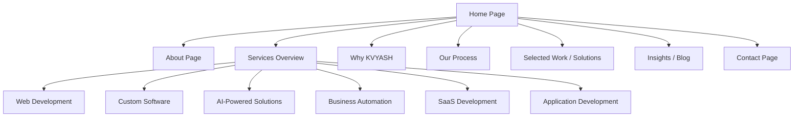
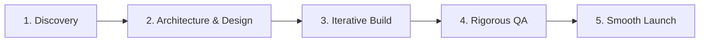

# Product Requirements Document (PRD)
## KVYASH Technologies - Official Website

**Document Version:** 1.0.0  
**Status:** Draft / Pending Review  
**Date:** August 9, 2026  
**Author:** Product Management Team, KVYASH Technologies  

---

### Table of Contents
1. [Product Overview](#1-product-overview)
2. [Product Vision](#2-product-vision)
3. [Product Goals](#3-product-goals)
4. [Target Audience](#4-target-audience)
5. [User Personas](#5-user-personas)
6. [User Problems](#6-user-problems)
7. [Value Proposition](#7-value-proposition)
8. [Website Objectives](#8-website-objectives)
9. [Business Objectives](#9-business-objectives)
10. [Complete Sitemap](#10-complete-sitemap)
11. [Page-by-Page Requirements](#11-page-by-page-requirements)
12. [Home Page Requirements](#12-home-page-requirements)
13. [About Page Requirements](#13-about-page-requirements)
14. [Services Page Requirements](#14-services-page-requirements)
15. [Individual Service Page Requirements](#15-individual-service-page-requirements)
16. [Solutions/Work Page Requirements](#16-solutionswork-page-requirements)
17. [Why KVYASH Page/Section](#17-why-kvyash-pagesection)
18. [Process Page/Section](#18-process-pagesection)
19. [Insights/Blog Requirements](#19-insightsblog-requirements)
20. [Contact Page Requirements](#20-contact-page-requirements)
21. [Navigation Requirements](#21-navigation-requirements)
22. [Footer Requirements](#22-footer-requirements)
23. [CTA Strategy](#23-cta-strategy)
24. [Lead-Generation Requirements](#24-lead-generation-requirements)
25. [SEO Requirements](#25-seo-requirements)
26. [Accessibility Requirements](#26-accessibility-requirements)
27. [Responsive Requirements](#27-responsive-requirements)
28. [Performance Requirements](#28-performance-requirements)
29. [Analytics Requirements](#29-analytics-requirements)
30. [Error/Empty States](#30-errorempty-states)
31. [Content Requirements](#31-content-requirements)
32. [Non-Functional Requirements](#32-non-functional-requirements)
33. [MVP Scope](#33-mvp-scope)
34. [Future Scope](#34-future-scope)
35. [Success Metrics](#35-success-metrics)

---

### Priority Definitions
To help structure the development roadmap, features and requirements are prioritized as follows:
- **P0 (Critical):** Core functionality required for launch. The website cannot go live without these.
- **P1 (High):** Important features that represent significant business value or core user experience. Targeted for launch or immediately post-launch.
- **P2 (Medium/Low):** Nice-to-have features, enhancements, or complex integrations that can be deferred to a later release.

---

### 1. Product Overview
KVYASH Technologies requires a premium, professional, and authentic marketing website. The company builds modern, thoughtful digital solutions for businesses and startups. The website will serve as the primary digital touchpoint for prospective clients, partners, and talent, articulating who KVYASH is, the quality of their work, and how they solve real-world problems.

### 2. Product Vision
To establish an industry-leading digital presence that exudes trust, technical mastery, and execution discipline. Unlike standard agency websites that rely on inflated claims or stock representations, the KVYASH Technologies site must stand out through its **uncompromising authenticity, high-fidelity design aesthetics, and clear proof of capability**. The website will feel premium, human, and directly aligned with the company’s positioning as a premium software consultancy.

### 3. Product Goals
- **Establish Trust:** Demonstrate domain expertise and execution capabilities through clean design, technical clarity, and authentic communication.
- **Generate Leads:** Convert visiting founders, executives, and product managers into qualified project leads.
- **Differentiate:** Set KVYASH apart from traditional outsourcing agencies by emphasizing "thoughtful solutions" and custom software craft rather than raw staff-augmentation.

### 4. Target Audience
The primary audience consists of decision-makers seeking external engineering, design, or automation support:
1. **Startup Founders & Co-founders:** Seeking a reliable tech partner to build MVPs or scale their initial product. They value velocity, modern stacks, and product-focused development.
2. **SME Executives & Business Owners:** Looking to automate operational workflows, transition from spreadsheets to custom software, or build customer-facing web/mobile applications.
3. **Enterprise Product Managers & Innovation Leads:** Seeking specialized engineering teams for specific components (e.g., AI-powered integrations, SaaS scaling).

### 5. User Personas

| Persona Name | Role | Core Motivations | Primary Pain Points |
| :--- | :--- | :--- | :--- |
| **Siddharth Mehta** | Tech Startup Founder (Pre-Seed/Seed) | Launch a robust MVP quickly to secure a seed round. | Hard to find reliable developers; fears low-quality code; values architectural scalability and transparent pricing. |
| **Meera Nair** | COO of Mid-sized Logistics SME | Modernize internal systems and automate paper-based workflows. | Skeptical of agencies using overly complex jargon; worried about project delays and poor post-launch support. |
| **Dr. Adrian Chen** | Head of Product, HealthTech Corp | Add AI-based categorization capabilities to an existing software product. | Finding agency teams with actual engineering rigor rather than developers who copy-paste basic APIs. |

### 6. User Problems
- **Lack of Trust in Agencies:** The market is saturated with agencies claiming "100% success rates," "thousands of projects," and using fake partner logos. Clients struggle to identify authentic partners.
- **Technical Obfuscation:** Agencies often explain solutions in buzzwords, leaving non-technical clients confused and technical clients unconvinced.
- **High Scoping Friction:** Initiating a conversation with a technology partner often requires filling out long, exhaustive forms or dealing with aggressive sales reps.

### 7. Value Proposition
> **"We build thoughtful digital solutions that solve real business problems."**

KVYASH Technologies does not just write code; we design and execute targeted digital interventions that save operational time, drive customer engagement, and enable product scale. Our process is transparent, our engineering is rigorous, and our commitment to business outcomes is absolute.

### 8. Website Objectives
- **P0:** Introduce KVYASH’s six core services cleanly and professionally.
- **P0:** Provide an intuitive contact funnel for prospective clients.
- **P1:** Provide a transparent description of the client-partner working process.
- **P1:** Show technology stacks and capabilities to build technical authority.

### 9. Business Objectives
- Increase inbound qualified leads by 25% quarter-over-quarter.
- Maintain a bounce rate below 35% by delivering high-fidelity visual and content experiences.
- Serve as the single source of truth for marketing collaterals and sales proposals.

---

### 10. Complete Sitemap

---

### 11. Page-by-Page Requirements
Each page must adhere strictly to the **premium light theme**:
- **Background:** High-quality white/light gray surfaces (`#FFFFFF`, `#F8FAFC`).
- **Typography:** Deep navy text (`#0F172A`) for high contrast, combined with muted slate secondary text (`#475569`).
- **Primary Accent:** KVYASH Blue (`#2563EB` or `#1D4ED8`).
- **Layout:** Generous whitespace, clean borders, minimal light gradients, and premium cards with soft, subtle shadows (`box-shadow: 0 4px 6px -1px rgb(0 0 0 / 0.05)`).

---

### 12. Home Page Requirements
The Home Page acts as the front door of KVYASH Technologies. It must instantly convey credibility, refinement, and technical capability.

#### Functional Requirements
1. **Navbar (P0):** Logo, navigation links, and a prominent "Get in Touch" primary CTA button. (Sticky/Fixed on scroll with glassmorphism styling).
2. **Hero Section (P0):**
   - High-impact, clean typography stating the core value proposition.
   - Subtext focusing on thoughtful engineering.
   - Dual CTAs: Primary ("Let's Talk") and Secondary ("View Our Work").
   - Abstract, premium light-themed visual element (e.g., interactive SVG network, subtle CSS-animated grids, or CSS particle elements).
3. **Services Overview (P0):**
   - Grid layout of the 6 core services.
   - Custom-styled icons or minimal vector graphic representations.
   - Short descriptions with direct links to individual service pages.
4. **About/Company Introduction (P0):**
   - Brief profile of the firm, emphasizing an engineering-first culture.
   - Focus on building solid relationships rather than raw scale.
5. **Why KVYASH (P1):**
   - Grid of key differentiators (e.g., Direct Engineer Communication, Long-Term Scalability, Fixed Scope Delivery).
6. **How We Work (P1):**
   - A step-by-step interactive timeline or card deck illustrating the development lifecycle.
7. **Selected Work / Solutions (P1):**
   - Carousel or grid showcasing simulated architecture cases or general problem-solution-result flow charts.
8. **Technology/Capabilities Grid (P1):**
   - Categorized tabs (Frontend, Backend, Cloud, AI) displaying the specific stacks utilized (React, Next.js, Node.js, Python, AWS, etc.).
9. **Final CTA (P0):**
   - A full-width premium card prompting users to start their project journey.
10. **Footer (P0):**
    - Sitemaps, contact information, social links, and copyright text.

#### Acceptance Criteria
- Page loads under 1.2 seconds (FCP) on high-speed desktop connections.
- Visual elements resize seamlessly down to 320px width (Mobile SE).
- Hover effects on cards use smooth transitions (`transition: all 0.3s ease-in-out`).

---

### 13. About Page Requirements
Builds brand context, team philosophy, and values.

#### Functional Requirements
- **The KVYASH Story (P1):** Explains why the firm was founded—to bridge the gap between business objectives and tech implementation.
- **Core Philosophy (P1):** Outlines our approach to code quality, security, and user experience.
- **Founding Values (P0):** Focuses on Transparency, Pragmatism, and Architectural Rigor.
- **No False Claims Rule (P0):** Do not invent false history or fake teams. Focus strictly on execution methodology, design standards, and technological capabilities.

---

### 14. Services Page Requirements
An overview hub directing visitors to specific expertise pages.

#### Functional Requirements
- **Services Grid (P0):** 6 key blocks with micro-interactions (e.g., scale-on-hover, subtle shadow enhancement).
- **Core Deliverables Table (P1):** Clear breakdown of what a client receives (e.g., Clean Repository, Figma Files, CI/CD pipelines).
- **Tech Alignment Map (P2):** Graphic representing which technology fits which service type.

---

### 15. Individual Service Page Requirements
Six separate pages, one for each core offering. Each page must explain the *what*, *why*, and *how*.

#### Core Services List:
1. **Web Development:** Modern, SEO-optimized, super-fast websites.
2. **Custom Software Development:** Tailored databases, ERPs, and workflow engines.
3. **AI-Powered Solutions:** Large language model integrations, intelligent data categorizers, and custom data search.
4. **Business Automation:** Integrating legacy systems, CRM custom flows, automated reports.
5. **SaaS Development:** Scalable multi-tenant products, subscriptions, and API architectures.
6. **Application Development:** High-performance mobile and desktop application solutions.

#### Functional Requirements (per page)
- **Service Blueprint (P0):** Clear explanation of the business problems this service addresses.
- **Architecture Highlight (P1):** Abstract diagram or text structure showing how we design these systems.
- **Typical Deliverables (P1):** Bullet points of items delivered (e.g., "PostgreSQL Database Schema", "Next.js frontend with Tailwind/CSS modules").

---

### 16. Solutions/Work Page Requirements
Focus on showcasing capability through conceptual projects and high-level architectural walkthroughs.

#### Functional Requirements
- **No Fake Clients Rule (P0):** Do not invent fake brand names or fake testimonial quotes.
- **Case Workflows (P1):** Frame work as "System Solutions." E.g., "Client Dashboard for SaaS Platforms," detailing how the challenge was met technically.
- **Architecture Blueprints (P1):** Provide visual diagrams showing layout and flow charts of solutions designed by KVYASH.

---

### 17. Why KVYASH Page/Section
Elaborates on the specific engineering culture that makes KVYASH different.

#### Key Content Blocks (P1)
- **Direct Access to Engineers:** No accounts-person wall. Direct communication with the creators.
- **Zero Bloat Policy:** We don't recommend tech you don't need.
- **Long-Term Support:** Standard transition support and clean handoff documentations.

---

### 18. Process Page/Section
Visualizes the execution path from initial call to deployment.

#### Step Details (P1)
- **1. Discovery:** 1-on-1 scoping, technical requirements document.
- **2. Design:** Figma mockups, user-flows, data architecture plan.
- **3. Iterative Build:** Bi-weekly demos, staging environment access.
- **4. QA:** Automated testing, multi-device layouts checks.
- **5. Launch:** Production deployment, analytics integration, documentation handover.

---

### 19. Insights/Blog Requirements
Demonstrates industry thought-leadership and engineering expertise.

#### Functional Requirements
- **Article Grid (P1):** Layout displaying blog posts. Filterable by tags (Engineering, AI, Automation, Product Design).
- **Rich Text Support (P1):** Clean formatting for code blocks, lists, quotes, and headers.
- **Newsletter Subscription (P2):** Minimal email-only input block to receive updates.

---

### 20. Contact Page Requirements
The primary lead-capture point. Must be simple, highly accessible, and low friction.

#### Functional Requirements
- **Contact Form (P0):**
  - Input fields: Name, Email, Organization, Project Type (dropdown based on Services), Message.
  - Verification: Live frontend inline validation (P0).
- **Secondary Contact Channels (P1):**
  - Company Email address (e.g., `hello@kvyash.com` or similar placeholder to be verified).
  - Timezone/Location representation (showing transparency).

---

### 21. Navigation Requirements
- **P0 Header:** Brand logo link, menu links, CTA button. Sticky layout with background-blur on scroll.
- **P0 Mobile Menu:** Slide-out drawer or full-screen menu overlay with large touch targets.
- **P0 Footer Navigation:** Sitemap categories, privacy policy, terms of service, and socials.

---

### 22. Footer Requirements
- **Layout (P0):** Multi-column structure.
  - Column 1: KVYASH Logo and brief bio ("We build thoughtful digital solutions...").
  - Column 2: Sitemap (Home, About, Services, Process, Insights).
  - Column 3: Services (Web Dev, Custom Software, AI Solutions, SaaS).
  - Column 4: Contact/Legal details.
- **Social links (P1):** Icons for LinkedIn, GitHub, and Twitter/X.

---

### 23. CTA Strategy
A standardized hierarchy of CTAs across the site:
- **Primary CTA:** "Let's Talk" / "Start Your Project". Styled in high-contrast solid KVYASH Blue.
- **Secondary CTA:** "View Services" / "Read Our Process". Styled as border-only buttons with background hover transitions.
- **In-Content CTA:** Inline hyperlinks with micro-animation arrows `→` moving on hover.

---

### 24. Lead-Generation Requirements
- **Simple Intake Forms (P0):** Form data captured and sent to email or CMS.
- **Post-Submission State (P0):** Dynamic thank-you message on-page, avoiding redirection where possible.
- **Form Analytics (P2):** Tracking form submission events.

---

### 25. SEO Requirements
- **P0 Meta Data:** Title, description, and keywords for each page.
- **P0 Semantic Markup:** Correct HTML tags (`header`, `main`, `section`, `footer`, `h1`, `h2`, `h3`, `p`).
- **P1 Open Graph:** Metadata for social shares (OG Image, OG Title, OG Description).
- **P1 Sitemap & Robots:** Automatically generated `sitemap.xml` and `robots.txt`.

---

### 26. Accessibility (a11y) Requirements
- **P0 Contrast:** Text elements must pass WCAG 2.1 AA contrast ratios (minimum 4.5:1 for body text, 3:1 for headers).
- **P0 Keyboard Navigation:** Focus states visible for all links, buttons, and form inputs.
- **P1 Alt Tags:** Meaningful alt text on all static imagery and icons.

---

### 27. Responsive Requirements
- **Grid Layouts:** Dynamic wrapping based on CSS Grid and Flexbox.
- **Breakpoints:**
  - Mobile: `320px` to `767px`
  - Tablet: `768px` to `1024px`
  - Desktop: `1025px` and above

---

### 28. Performance Requirements
- **Core Web Vitals:**
  - **LCP (Largest Contentful Paint):** < 1.5s (P1)
  - **FID (First Input Delay):** < 100ms (P0)
  - **CLS (Cumulative Layout Shift):** < 0.1 (P0)
- **Asset Optimization:** WebP for images, minified CSS/JS, and optimized system or system-adjacent web fonts.

---

### 29. Analytics Requirements
- **P1 Tracking:** Integration setup for Google Analytics 4 (GA4) or privacy-first alternative (e.g., Plausible).
- **P1 Event Tracking:** Trigger actions on CTA click, form submission, and blog read-depth.

---

### 30. Error/Empty States
- **P0 404 Page:** Premium custom 404 page featuring a clear search field or a direct link to return Home.
- **P0 Form Submission Error:** Clear inline warning message in red styling, explaining why the submission failed.

---

### 31. Content Requirements
- **Voice:** Professional, engineering-focused, conversational yet direct.
- **Authenticity Policy:** Zero hyperbole. No claims of "best in the world".
- **Visuals:** Keep imagery technical and architectural (clean mockups, flow diagrams) rather than generic corporate stock photos (e.g., handshakes, gears).

---

### 32. Non-Functional Requirements
- **Security (P0):** SSL/TLS certificate configured, forms protected against CSRF and spam (e.g., honeypot fields).
- **Hosting (P0):** Static hosting via CDN (Vercel, Netlify, or AWS CloudFront) for global speed.
- **Maintainability (P1):** Component-driven structure in the repository, making it easy to add new services or insights.

---

### 33. MVP Scope
The MVP focuses on establishing the identity, services, and lead intake capabilities.

| Phase | Pages Included | Key Features |
| :--- | :--- | :--- |
| **MVP (P0 & P1)** | Home, About, Services Hub, Contact, Process Section. | Complete navigation, premium styling, custom form validation, full mobile responsiveness. |
| **Phase 2 (P2)** | Insights/Blog, Individual Service Detail Pages, Interactive Tech Selector. | Blog search, tagging, rich text rendering, newsletter capture, case study deep dives. |

---

### 34. Future Scope
- **Interactive Project Scoper (P2):** Multi-step estimator tool allowing potential clients to outline scope and get a rough architectural blueprint dynamically.
- **Client Portal (P2):** Integrated dashboard for active projects to view timelines, task lists, and release versions.

---

### 35. Success Metrics
- **Conversion Rate:** 2.5% of unique visitors filling out the contact form.
- **Page Load Time:** Maintaining an A-grade rating on Lighthouse/PageSpeed Insights.
- **Engagement Time:** Average session duration over 1 minute 30 seconds.
- **Form Spam Rate:** Less than 5% spam entries through security and honeypots.

---
*End of Product Requirements Document (PRD)*
