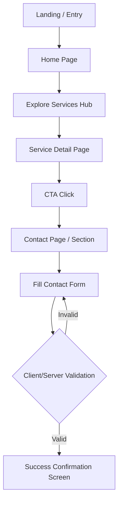
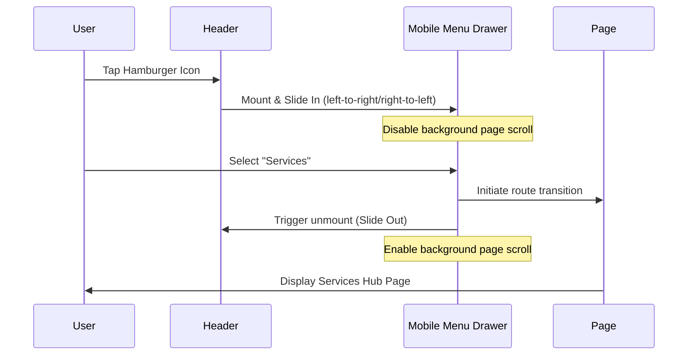

# User Flow and Journeys Document
## KVYASH Technologies - Official Website

**Document Version:** 1.0.0  
**Status:** Draft / Pending Review  
**Date:** August 9, 2026  
**Author:** Product Design Team, KVYASH Technologies  

---

### Table of Contents
1. [Core Structural Map](#1-core-structural-map)
2. [Flow Maps](#2-flow-maps)
   - [Home Flow](#home-flow)
   - [Services Flow](#services-flow)
   - [Work Flow](#work-flow)
   - [Contact Flow](#contact-flow)
3. [Detailed User Flow Scenarios](#3-detailed-user-flow-scenarios)
   - [Flow 1: First-Time Visitor](#flow-1-first-time-visitor)
   - [Flow 2: Returning Visitor](#flow-2-returning-visitor)
   - [Flow 3: Visitor Exploring Services](#flow-3-visitor-exploring-services)
   - [Flow 4: Visitor Viewing a Specific Service](#flow-4-visitor-viewing-a-specific-service)
   - [Flow 5: Visitor Viewing Solutions/Work](#flow-5-visitor-viewing-solutionswork)
   - [Flow 6: Visitor Reading an Insight/Blog](#flow-6-visitor-reading-an-insightblog)
   - [Flow 7: Visitor Contacting KVYASH](#flow-7-visitor-contacting-kvyash)
   - [Flow 8: Visitor Submitting Contact Form](#flow-8-visitor-submitting-contact-form)
   - [Flow 9: Invalid Form Submission](#flow-9-invalid-form-submission)
   - [Flow 10: Successful Enquiry Submission](#flow-10-successful-enquiry-submission)
   - [Flow 11: Mobile User](#flow-11-mobile-user)
   - [Flow 12: Tablet User](#flow-12-tablet-user)
   - [Flow 13: Desktop User](#flow-13-desktop-user)
   - [Flow 14: 404 Page](#flow-14-404-page)
   - [Flow 15: External Social-Media Navigation](#flow-15-external-social-media-navigation)
4. [Information Architecture](#4-information-architecture)
5. [Navigation Hierarchy](#5-navigation-hierarchy)
6. [Conversion Paths](#6-conversion-paths)
7. [Mobile Navigation Flow](#7-mobile-navigation-flow)
8. [Footer Navigation Flow](#8-footer-navigation-flow)

---

### 1. Core Structural Map



---

### 2. Flow Maps

#### Home Flow
```
Navbar 
  → Hero Section (Immediate Value Prop)
  → Services Section (What We Build)
  → About Section (Who We Are)
  → Why KVYASH (Engineering Credo)
  → Process (How We Build)
  → Work/Solutions (Proof of Work)
  → Final CTA Block (Lead Intake Invitation)
  → Footer (Structural Sitemap)
```

#### Services Flow
```
Services Hub Page 
  → Select Service Page (e.g., Web Development)
  → Service Detail Page (Blueprint & Problems Solved)
  → Service Benefits (Value Proposition)
  → Development Process (How We Deliver)
  → Page CTA ("Let's Talk")
  → Contact Form (Lead capture)
```

#### Work Flow
```
Solutions/Work Hub 
  → Select Project / Case Study
  → Project Overview (Context)
  → Problem Statement (Real business bottleneck)
  → Engineering Approach (How we thought about it)
  → Technology Stack Used (Pragmatic tool choice)
  → Outcome (Success metrics)
  → CTA (Request similar outcome)
```

#### Contact Flow
```
Contact Page 
  → Enter Project Details (Name, Email, Organization, Message)
  → Real-time inline field validation
  → Submit Click
  → Success Confirmation Message (Acknowledge receipt and next steps)
```

---

### 3. Detailed User Flow Scenarios

For every flow, the interactions are mapped across six core metrics:
- **User Action:** What the user clicks or types.
- **System Response:** What the web application displays or updates.
- **Next Screen:** The visual location or page destination.
- **Possible Error:** What could fail during the journey.
- **CTA:** The direct button or hyperlink guiding the user.
- **Exit Point:** Where the user is likely to leave the website.

---

#### Flow 1: First-Time Visitor
- **User Action:** Arrives via search or direct link on Home Page.
- **System Response:** Renders the Hero section quickly; serves the primary value proposition.
- **Next Screen:** Home Page Hero section.
- **Possible Error:** Content renders slowly (FCP failure).
- **CTA:** "View Services" (Secondary CTA).
- **Exit Point:** Closes the tab immediately if the visual layout is cluttered.

#### Flow 2: Returning Visitor
- **User Action:** Types domain or accesses from bookmarks.
- **System Response:** Renders Home Page immediately from cache (Next.js client routing).
- **Next Screen:** Home Page (remembers scroll position if session is persistent).
- **Possible Error:** Stale cache loading outdated blog headlines.
- **CTA:** "Let's Talk" (Primary Nav CTA).
- **Exit Point:** Navigates directly to "Contact" or leaves if looking for a client portal (Phase 2).

#### Flow 3: Visitor Exploring Services
- **User Action:** Clicks "Services" link in Header.
- **System Response:** Performs smooth client transition to `/services` overview.
- **Next Screen:** Services Hub Page.
- **Possible Error:** Broken service routing mapping.
- **CTA:** "Read More" under Web Development or AI-solutions.
- **Exit Point:** Leaves page if the service list is overly generic.

#### Flow 4: Visitor Viewing a Specific Service
- **User Action:** Clicks a specific service card (e.g., "AI-Powered Solutions").
- **System Response:** Navigates to `/services/ai-solutions`.
- **Next Screen:** Service Detail Page.
- **Possible Error:** 404 Route parameter misalignment.
- **CTA:** "Discuss an AI Integration".
- **Exit Point:** Closes site if technical descriptions lack engineering depth.

#### Flow 5: Visitor Viewing Solutions/Work
- **User Action:** Clicks "Work" in Navbar.
- **System Response:** Loads `/work` grid showing technical problem-solving blueprints.
- **Next Screen:** Selected Work / Solutions Page.
- **Possible Error:** Empty state if case studies fail compilation dynamically.
- **CTA:** "Explore Architecture Blueprint".
- **Exit Point:** Closes tab if case details seem fabricated or overly corporate.

#### Flow 6: Visitor Reading an Insight/Blog
- **User Action:** Clicks "Insights" in Header, then selects a technical post.
- **System Response:** Serves MDX article rendering code blocks and diagrams.
- **Next Screen:** Individual Blog Post (`/insights/scalable-nextjs-architecture`).
- **Possible Error:** Broken markdown parsing rendering raw syntax blocks.
- **CTA:** "Subscribe to Engineering updates".
- **Exit Point:** Leaves site after finishing the article.

#### Flow 7: Visitor Contacting KVYASH
- **User Action:** Clicks "Let's Talk" in Header.
- **System Response:** Navigates to `/contact`. Focuses keyboard cursor on the name input field.
- **Next Screen:** Contact Page.
- **Possible Error:** Layout misaligned on mobile screen.
- **CTA:** "Submit Enquiry".
- **Exit Point:** Closes page if the form contains too many fields.

#### Flow 8: Visitor Submitting Contact Form
- **User Action:** Fills in form data and clicks "Send Message".
- **System Response:** Triggers API fetch request, displaying a loading indicator on the submit button.
- **Next Screen:** Stays on `/contact` with dynamic inline loaders.
- **Possible Error:** Network failure or rate-limiting error.
- **CTA:** "Send Message" (disabled during active submission).
- **Exit Point:** Closes tab before request returns status.

#### Flow 9: Invalid Form Submission
- **User Action:** Enters an invalid email format and clicks "Send Message".
- **System Response:** Rejects request instantly. Toggles red inline error text: `"Invalid email address format"`.
- **Next Screen:** Contact form displaying inline error highlights.
- **Possible Error:** Browser autocomplete covers inline validation error.
- **CTA:** "Send Message".
- **Exit Point:** Abandons form due to input frustration.

#### Flow 10: Successful Enquiry Submission
- **User Action:** Inputs valid data, passes honeypot test, and clicks submit.
- **System Response:** Server returns HTTP 200. Form section fades out, rendering a clean success confirmation.
- **Next Screen:** Dynamic Success Confirmation Card on `/contact`.
- **Possible Error:** API returns success but the automated email dispatch fails in backend (silent fail).
- **CTA:** "Return Home" / "Read Our Insights".
- **Exit Point:** Returns to Home or exits the browser with confidence.

#### Flow 11: Mobile User
- **User Action:** Taps hamburger menu button in Header.
- **System Response:** Smoothly slides out the mobile navigation drawer.
- **Next Screen:** Mobile Menu Overlay.
- **Possible Error:** Toggle button overlaps page elements, blocking close action.
- **CTA:** "Contact Us" (Primary mobile menu button).
- **Exit Point:** Closes drawer or leaves site due to rendering scale bugs.

#### Flow 12: Tablet User
- **User Action:** Taps links in responsive header layout.
- **System Response:** Standard horizontal header displays, scaling margins cleanly.
- **Next Screen:** Selected site page.
- **Possible Error:** Horizontal layouts overflow the screen viewport.
- **CTA:** Navigation links.
- **Exit Point:** Standard exits based on page content.

#### Flow 13: Desktop User
- **User Action:** Moves cursor over cards and services grid.
- **System Response:** Displays elegant, restrained hover animations (e.g., slight lift, border-color change to KVYASH blue).
- **Next Screen:** Selected site page.
- **Possible Error:** Animations cause layout shifts (CLS issues).
- **CTA:** Standard page CTAs.
- **Exit Point:** Exits based on context.

#### Flow 14: 404 Page
- **User Action:** Types an invalid sub-path or clicks an outdated link.
- **System Response:** Renders a clean, styled 404 template.
- **Next Screen:** `/404` Page.
- **Possible Error:** Loop redirects if returning home fails.
- **CTA:** "Return to Home Page".
- **Exit Point:** Closes browser if navigation alternatives are missing.

#### Flow 15: External Social-Media Navigation
- **User Action:** Clicks GitHub or LinkedIn icon in Footer.
- **System Response:** Opens target URL in a new browser tab (`target="_blank" rel="noopener noreferrer"`).
- **Next Screen:** External website (e.g., GitHub).
- **Possible Error:** Link returns a 404 or points to a deleted profile.
- **CTA:** External profile link.
- **Exit Point:** Navigates away from website to social media platform.

---

### 4. Information Architecture

```
[Level 0: Root] / (Home Page)
├── [Level 1: Core Navigation]
│   ├── /about (About KVYASH)
│   ├── /services (Services Hub)
│   │   ├── /services/web-development
│   │   ├── /services/custom-software
│   │   ├── /services/ai-solutions
│   │   ├── /services/business-automation
│   │   ├── /services/saas-development
│   │   └── /services/application-development
│   ├── /work (Solutions/Work Showcase)
│   ├── /insights (Engineering Blog Hub)
│   │   └── /insights/[article-slug] (Blog Posts)
│   └── /contact (Lead Generation Form)
└── [Level 1: Utility & Legal]
    ├── /404 (Not Found Template)
    ├── /privacy-policy (Compliance)
    └── /terms (Terms of Service)
```

---

### 5. Navigation Hierarchy
- **Header Navigation (P0):** Flat, quick access links.
  - Home (Logo) | About | Services | Work | Insights | **[Let's Talk]**
- **Mobile Menu (P0):** Slide-out panel overlay.
  - Home | About | Services | Work | Insights | **[Let's Talk]**
- **Footer Navigation (P1):** Multi-tiered links grouped by category.
  - **Company:** About Us, Technical Credo, Contact.
  - **Services:** Web Dev, Custom Software, AI Solutions, SaaS.
  - **Resources:** Insights, Open-Source.
  - **Legal:** Privacy, Terms.

---

### 6. Conversion Paths

#### The Direct Route (P0)
- High intent users seeking immediate consultations.
```
Home Page (Hero / Header) ── Let's Talk CTA ──> Contact Form ──> Successful Submission
```

#### The Validation Route (P1)
- Users researching technical competence before initiating contact.
```
Home Page ──> Services Hub ──> AI-Solutions Page ──> Solutions Page ──> Section CTA ──> Contact Form
```

#### The Educational Route (P1)
- Organic search users arriving via blog posts.
```
Google Search ──> Insights Post ──> Footer/Inline CTA ──> Contact Form ──> Successful Submission
```

---

### 7. Mobile Navigation Flow



---

### 8. Footer Navigation Flow
The Footer provides an alternate navigation route designed to capture users who scroll to the end of a page without converting.

```mermaid
graph TD
    Footer[Footer Section] --> Col1[Company Bio & Socials]
    Footer --> Col2[Service Detail Links]
    Footer --> Col3[Core Sitemap Links]
    Footer --> Col4[Legal & Compliance]

    Col1 --> LinkLinkedIn[LinkedIn - target: _blank]
    Col1 --> LinkGitHub[GitHub - target: _blank]

    Col2 --> LinkWebDev[/services/web-development]
    Col2 --> LinkSaaS[/services/saas-development]

    Col3 --> LinkAbout[/about]
    Col3 --> LinkContact[/contact]

    Col4 --> LinkPrivacy[/privacy-policy]
```

---
*End of User Flow and Journeys Document*
